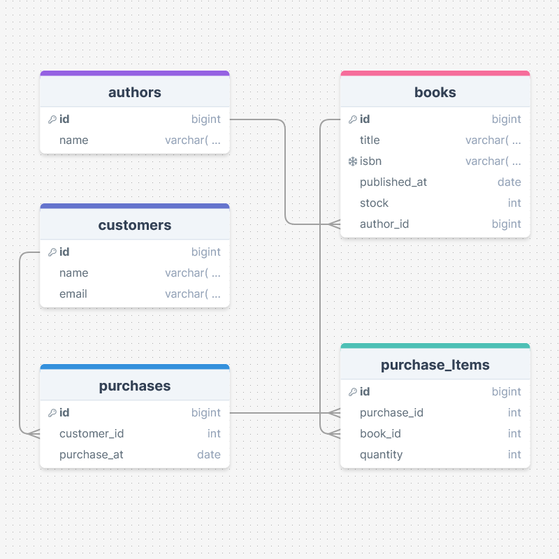

# Online Bookstore Database

This project is a simple database system for an online bookstore. It keeps track of books, authors, customers, and purchases. 

## ER Diagram

The ER diagram below illustrates the relationship between these entities:



## Database Schema

The following SQL commands create the necessary tables based on the ER diagram:

```sql
-- Author table
CREATE TABLE Author (
    AuthorID INT PRIMARY KEY,
    Name VARCHAR(100) NOT NULL
);

-- Book table
CREATE TABLE Book (
    BookID INT PRIMARY KEY,
    Title VARCHAR(200) NOT NULL,
    ISBN VARCHAR(20) UNIQUE NOT NULL,
    PublishedDate DATE NOT NULL,
    Stock INT NOT NULL,
    AuthorID INT,
    FOREIGN KEY (AuthorID) REFERENCES Author(AuthorID)
);

-- Customer table
CREATE TABLE Customer (
    CustomerID INT PRIMARY KEY,
    Name VARCHAR(100) NOT NULL,
    Email VARCHAR(100) UNIQUE NOT NULL
);

-- Purchase table
CREATE TABLE Purchase (
    PurchaseID INT PRIMARY KEY,
    CustomerID INT,
    PurchaseDate DATE NOT NULL,
    FOREIGN KEY (CustomerID) REFERENCES Customer(CustomerID)
);

-- PurchaseItem table
CREATE TABLE PurchaseItem (
    PurchaseItemID INT PRIMARY KEY,
    PurchaseID INT,
    BookID INT,
    Quantity INT NOT NULL,
    FOREIGN KEY (PurchaseID) REFERENCES Purchase(PurchaseID),
    FOREIGN KEY (BookID) REFERENCES Book(BookID)
);

```


## SQL Queries

1. Display a list of 20 latest published in-stock book titles of the store:
```sql
SELECT Title
    FROM Book
    WHERE Stock > 0
    ORDER BY PublishedDate DESC
    LIMIT 20;
```

2. Retrieve a list of all purchases since January 01, 2024:

```sql 
SELECT *
    FROM Purchase
    WHERE PurchaseDate >= '2024-01-01';

```

3. List down all the authors in the database who have “Mohammad” or “MD” at the beginning of their name, sorted by the names (alphabetically):


```sql 
SELECT Name
    FROM Author
    WHERE Name LIKE 'Mohammad%' OR Name LIKE 'MD%'
    ORDER BY Name ASC;

```
## Assumptions

    1. Each book is written by only one author.
    2. The Stock attribute in the Book table represents the number of available copies of that book.
    3. The PurchaseDate attribute in the Purchase table records the date when the purchase was made.
    4. The Quantity attribute in the PurchaseItem table represents the number of copies of a particular book included in a purchase.

## How to Use
1. Clone the repository:

```sh 

```
2. Navigate to the project directory:

```sh 
cd online-bookstore-db
```
3. Open your preferred SQL database tool and run the SQL commands provided in the database_schema.sql file to create the tables.

4. Insert sample data into the tables to test the queries.

5. Run the SQL queries provided in the queries.sql file to get the required information.

## Contributing

If you would like to contribute to this project, please fork the repository and submit a pull request. We welcome all contributions!

## License

This project is licensed under the MIT License. See the LICENSE file for more details.

```sql

## Creating Supporting Files

### database_schema.sql

Create a file named `database_schema.sql` and add the following content:

```sql
-- Author table
CREATE TABLE Author (
    AuthorID INT PRIMARY KEY,
    Name VARCHAR(100) NOT NULL
);

-- Book table
CREATE TABLE Book (
    BookID INT PRIMARY KEY,
    Title VARCHAR(200) NOT NULL,
    ISBN VARCHAR(20) UNIQUE NOT NULL,
    PublishedDate DATE NOT NULL,
    Stock INT NOT NULL,
    AuthorID INT,
    FOREIGN KEY (AuthorID) REFERENCES Author(AuthorID)
);

-- Customer table
CREATE TABLE Customer (
    CustomerID INT PRIMARY KEY,
    Name VARCHAR(100) NOT NULL,
    Email VARCHAR(100) UNIQUE NOT NULL
);

-- Purchase table
CREATE TABLE Purchase (
    PurchaseID INT PRIMARY KEY,
    CustomerID INT,
    PurchaseDate DATE NOT NULL,
    FOREIGN KEY (CustomerID) REFERENCES Customer(CustomerID)
);

-- PurchaseItem table
CREATE TABLE PurchaseItem (
    PurchaseItemID INT PRIMARY KEY,
    PurchaseID INT,
    BookID INT,
    Quantity INT NOT NULL,
    FOREIGN KEY (PurchaseID) REFERENCES Purchase(PurchaseID),
    FOREIGN KEY (BookID) REFERENCES Book(BookID)
);

```

## queries.sql

Create a file named queries.sql and add the following content:
```sql
    
    -- 1. Display a list of 20 latest published in-stock book titles of the store:
    SELECT Title
    FROM Book
    WHERE Stock > 0
    ORDER BY PublishedDate DESC
    LIMIT 20;

    -- 2. Retrieve a list of all purchases since January 01, 2024:
    SELECT *
    FROM Purchase
    WHERE PurchaseDate >= '2024-01-01';

    -- 3. List down all the authors in the database who have “Mohammad” or “MD” at the beginning of their name, sorted by the names (alphabetically):
    SELECT Name
    FROM Author
    WHERE Name LIKE 'Mohammad%' OR Name LIKE 'MD%'
    ORDER BY Name ASC;


```