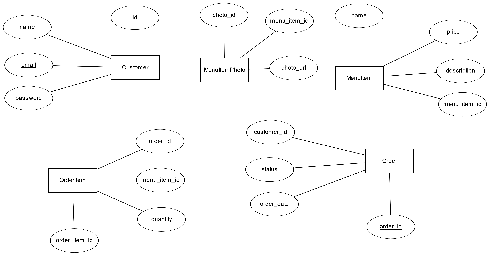

# [Database Course] Live-Test-1

## Cloud Kitchen Database System

This project involves designing a simple database system for a cloud kitchen. The system allows clients to make orders through an app, enabling them to see menu items, place orders, and track order statuses. The cloud kitchen manages its menu, orders, and customers via a web application.

## ER Diagram

The ER diagram illustrates the relationships between the entities in the database system:

- **Customer** (1) -- (M) **Order**
- **Order** (1) -- (M) **OrderItem**
- **OrderItem** (M) -- (1) **MenuItem**
- **MenuItem** (1) -- (M) **MenuItemPhoto**



## Database Schema (SQL)

Below is the SQL code for creating the tables in the database. The design complies with the third normal form of Database Normalization.

```sql
-- Create Customer Table
CREATE TABLE Customer (
    customer_id INT PRIMARY KEY AUTO_INCREMENT,
    name VARCHAR(100),
    email VARCHAR(100) UNIQUE,
    password VARCHAR(255)
);

-- Create MenuItem Table
CREATE TABLE MenuItem (
    menu_item_id INT PRIMARY KEY AUTO_INCREMENT,
    name VARCHAR(100),
    price DECIMAL(10, 2),
    description VARCHAR(255)
);

-- Create MenuItemPhoto Table
CREATE TABLE MenuItemPhoto (
    photo_id INT PRIMARY KEY AUTO_INCREMENT,
    menu_item_id INT,
    photo_url VARCHAR(255),
    FOREIGN KEY (menu_item_id) REFERENCES MenuItem(menu_item_id)
);

-- Create Order Table
CREATE TABLE `Order` (
    order_id INT PRIMARY KEY AUTO_INCREMENT,
    customer_id INT,
    order_date TIMESTAMP DEFAULT CURRENT_TIMESTAMP,
    status ENUM('new', 'in-progress', 'completed'),
    FOREIGN KEY (customer_id) REFERENCES Customer(customer_id)
);

-- Create OrderItem Table
CREATE TABLE OrderItem (
    order_item_id INT PRIMARY KEY AUTO_INCREMENT,
    order_id INT,
    menu_item_id INT,
    quantity INT,
    FOREIGN KEY (order_id) REFERENCES `Order`(order_id),
    FOREIGN KEY (menu_item_id) REFERENCES MenuItem(menu_item_id)
);


## SQL Queries

The following SQL queries address specific use cases for the cloud kitchen:

Display a list of 20 latest available menu items:

```sql 
SELECT * FROM MenuItem
ORDER BY menu_item_id DESC
LIMIT 20;

```

Retrieve a list of all incomplete orders of today, in oldest to newest order:

```sql
SELECT * FROM `Order`
WHERE status != 'completed'
AND DATE(order_date) = CURDATE()
ORDER BY order_date ASC;

```
Delete all complete orders that have been placed before 15 days:

```sql
DELETE FROM `Order`
WHERE status = 'completed'
AND order_date < (CURDATE() - INTERVAL 15 DAY);
```


